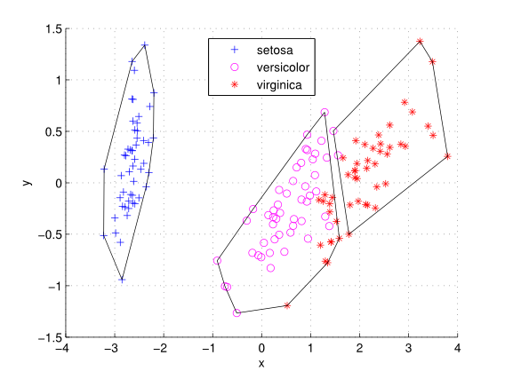
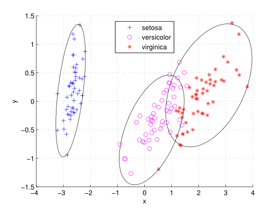

# User Manual

## Introduction

AMVIDC is a data clustering algorithm based on agglomerative 
hierarchical clustering (AHC) which uses minimum volume increase (MVI) 
and minimum direction change (MDC) as clustering criteria. The
algorithm is presented in detail in the following publication:

-   Fachada, N., Figueiredo, M.A.T., Lopes, V.V., Martins, R.C., Rosa, 
A.C., [Spectrometric differentiation of yeast strains using minimum volume 
increase and minimum direction change clustering criteria](http://www.sciencedirect.com/science/article/pii/S0167865514000889),
Pattern Recognition Letters (2014), doi: http://dx.doi.org/10.1016/j.patrec.2014.03.008

### Data format

Data for clustering is presented as a set of samples (or points), each 
with a constant number of dimensions. As such, for the rest of this 
guide, data matrices are considered to be in the following format:

-   *m* x *n*, with *m* samples (points) and *n* dimensions (variables)

### Generating data

AMVIDC was inspired on the differentiation of spectrometric data. 
However, to further validate the clustering algorithms, synthetic
data sets can be generated with the [generateData](generateData.m) 
function. This function generates data in the *m* x *n* format, with 
*m* samples (points) and *n* dimensions (variables) according to a set 
of parameters, which are explained in the source code.

## Running the algorithm

AMVIDC is implemented in the [clusterdata_amvidc](clusterdata_amvidc.m) 
function:

    idx = clusterdata_amvidc(X, k, idx_init);

where **X**, **k** and **idx\_init** are the data matrix, maximum number 
of clusters and initial clustering, respectively. Initial clustering 
is required so that all possible new clusters have volume, a requirement 
for MVI. The [clusterdata_amvidc](clusterdata_amvidc.m) function has many 
optional parameters, with reasonable defaults, as specified in the 
following table:

  Parameter    | Default                |  Options/Description
  ------------ | ---------------------- | ------------------------------------------------------------------------------------------------------
  *volume*     | ‘convhull’             |  Volume type: ‘ellipsoid’ or ‘convhull’
  *tol*        | 0.01                   |  Tolerance for minimum volume ellipse calculation (‘ellipsoid’ volume only)
  *dirweight*  | 0                      |  Direction weight in last iteration (0 means MDC linkage is ignored)
  *dirpower*   | 2                      |  Convergence power to dirweight (higher values make convergence steeper and occurring more to the end)
  *dirtype*    | ‘svd’                  |  Direction type: ‘pca’, ‘svd’
  *nvi*        | true                   |  Allow negative volume increase?
  *loglevel*   | 3 (show warnings only) |  Log level: 0 (show all messages) to 4 (only show critical errors), default is 3 (show warnings)

For example, to perform clustering using ellipsoid volume taking into
account direction change, where cluster direction is determined using
PCA, one would do:

    idx = clusterdata_mvidc(X, k, idx_init, 'volume', 'ellipsoid', 'dirweight',0.5, 'dirpower', 4, 'dirtype', 'pca');

As specified, the [clusterdata_amvidc](clusterdata_amvidc.m) function 
requires initial clusters which, if joined, produce new clusters with 
volume. Two functions are included for this purpose (however, others can be 
used):

-   [initClust](initClust.m) - Performs very simple initial clustering based
    on AHC with single linkage (nearest neighbor) and user defined
    distance. Each sample is associated with the same cluster of its
    nearest point. Allows to define a minimum size for each cluster,
    distance type (as supported by Matlab `pdist`) and the number of
    clusters which are allowed to have less than the minimum size.
-   [pddp](pddp.m) - Perform PDDP (principal direction divisive
    clustering) on input data. This implementation always selects the
    largest cluster for division, with the algorithm proceeding while
    the division of a cluster yields sub-clusters which can have a
    volume.

## Analysis of results

### F-score

The [F-score](http://en.wikipedia.org/wiki/F1_score) measure is used 
to evaluate clustering results. The measure is implemented in the 
[fscore](fscore.m) function. To run this function:

    eval = fscore(idx, numclasses, numclassmembers);

where:

-   **idx** - *m* x *1* vector containing the cluster indices of each
    point (as returned by the clustering functions)
-   **numclasses** - Correct number of clusters
-   **numclassmembers** - Vector with the correct size of each cluster
    (or a scalar if all clusters are of the same size)

The [fscore](fscore.m) function returns:

-   **eval** - Value between 0 (worst case) and 1 (perfect clustering)

### Plotting clusters

Visualizing how an algorithm grouped clusters can provide important 
insight on its effectiveness. Also, it may be important to visually 
compare an algorithm’s clustering result with the correct result. The 
[plotClusters](plotClusters.m) function can show two clustering results in the same 
image (e.g. the correct one and one returned by an algorithm). The 
[plotClusters](plotClusters.m) function can be executed in the following way:

    h_out = plotClusters(X, dims, idx_marker, idx_encircle, encircle_method, h_in);

where:

-   **X** - Data matrix, *m* x *n*, with m samples (points) and n
    dimensions (variables)
-   **dims** - Number of dimensions (2 or 3)
-   **idx_marker** - Clustering result^ to be shown directly in
    points using markers
-   **idx_encircle** - Clustering result^ to be shown using
    encirclement/grouping of points
-   **encircle_method** - How to encircle the **idx_encircle**
    result: ‘convhull’ (default), ‘ellipsoid’ or ‘none’
-   **h_in** - (Optional) Existing figure handle where to create
    plot

^ *m* x *1* vector containing the cluster indices of each point

The [plotClusters](plotClusters.m) function returns:

-   **h_out** - Figure handle of plot

## Example

In this example, we demonstrate how to test AMVIDC using 
[Fisher's iris data](http://en.wikipedia.org/wiki/Iris_flower_data_set), 
which is included in the MatLab Statistics Toolbox. We chose this data set
as it is readily available, not necessarily because AMVIDC is the most
appropriate algorithm to apply in this case. First, we load the data:

    >> load fisheriris

The data set consists of 150 samples, 50 samples for each of three 
species of the Iris flower. Four features (variables) were measured per 
sample. The data itself loads into the `meas` variable, while the
species to which each sample is associated with is given in the `species`
variable. The samples are ordered by species, so the first 50 samples
belong to one species, and so on. First, we test the 
[k-Means](http://en.wikipedia.org/wiki/K-means_clustering) algorithm,
specifying three clusters, one per species:

    >> idx_km = kmeans(meas, 3);

We can evaluate the performance of k-Means using the [fscore](fscore.m)
function (the value of 1 being perfect clustering):

```
>> fscore(idx_km, 3, [50, 50, 50])

ans =

    0.8918
```

Visual observation can be accomplished with the [plotClusters](plotClusters.m) 
function. First, [PCA](http://en.wikipedia.org/wiki/Principal_component_analysis)
is applied on the data, yielding its principal components (i.e., the 
components which have the largest possible variance). The first two 
components (the two directions of highest variance) are useful for 
visually discriminating the data in 2D, even though k-Means was 
performed on the four dimensions of the data). 

    >> [~, iris_pca] = princomp(meas);

We can now plot the data:

    >> plotClusters(iris_pca, 2, [50,50,50], idx_km);
    >> legend(unique(species), 'Location','Best')



AMVIDC is a computationally expensive algorithm, so it is preferable to
apply it on a reduced number of dimensions. The following command applies 
AMVIDC clustering to the first two principal components of the data set,
using [pddp](pddp.m) for the initial clustering, ellipsoid volume 
minimization and direction change minimization:

    >> idx_amvidc = clusterdata_amvidc(iris_pca(:, 1:2), 3, pddp(iris_pca(:, 1:2)), 'dirweight', 0.6, 'dirpower', 8, 'volume', 'ellipsoid');

The [fscore](fscore.m) evaluation is obtained as follows:

```
>> fscore(idx_amvidc, 3, [50, 50, 50])

ans =

    0.9599
```

Slightly better than k-Means. Visual inspection also provides a
good insight on the clustering result:

    >> plotClusters(iris_pca, 2, [50,50,50], idx_amvidc, 'ellipsoid');
    >> legend(unique(species), 'Location','Best');



